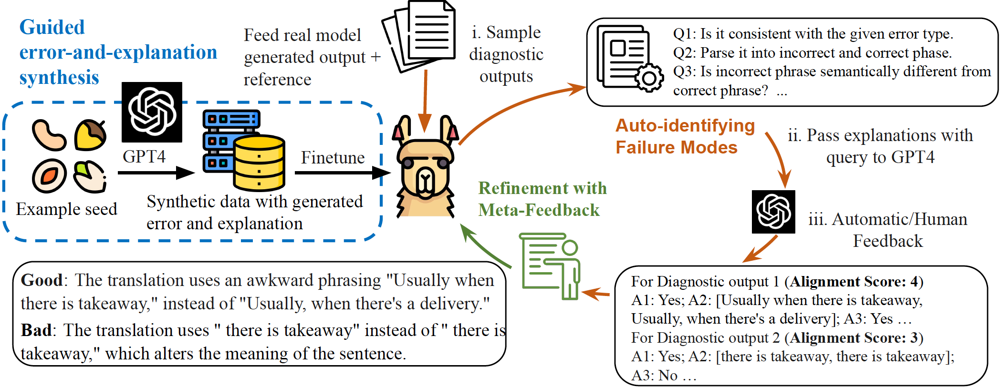

# InstructScore (SEScore3)

An amazing explanation metric (diagnostic report) for text generation evaluation

<div  align="center"> 

</div>

## Installation
We list all required dependencies in requirements.txt. You can create a conda environment and install all dependencies through following commands:

```bash
    conda create -n instructscore
    conda activate instructscore
    pip install -r requirements.txt
```

## Usage
There are two ways to use InstructScore.

### Option 1: Have a fast try through Huggingface
We have uploaded our model to Huggingface, which can be found [here](https://huggingface.co/xu1998hz/InstructScore).
You can directly try InstructScore via several lines of code:

```python
from InstructScore import InstructScore
# You can choose from 'mt_zh-en', 'caption', 'd2t', 'commonsense' or "key-to-text" to reproduce results in the paper
task_type == 'mt_zh-en' 
# Example input for X-English translation
refs = ["Normally the administration office downstairs would call me when there’s a delivery."]
outs = ["Usually when there is takeaway, the management office downstairs will call."]

# Example input for captioning generation
# task_type="caption"
# refs = ["The two girls are playing on a yellow and red jungle gym."]
# outs = ["The woman wearing a red bow walks past a bicycle."]

# Example input for table-to-text generation
# task_type="d2t"
# srcs = ["['Piotr_Hallmann | height | 175.26', 'Piotr_Hallmann | weight | 70.308']"]
# refs = ["Piotr Hallmann is 175.26 cm tall and weighs 70.308 kg."]
# outs = ["Piotr Hallmann has a height of 175.26 m and weights 70.308."]

# Example input for Commonsense text generation
# task_type="commonsense"
# srcs = ["food, eat, chair, sit"]
# refs = ["A man sitting on a chair eating food."]
# outs = ["a man eats food and eat chair sit in the beach."]

# Example input for keyword-to-text generation
# task_type="key-to-text"
# srcs = ["['X | type | placetoeat', "X | area | 'X'", 'X | pricerange | moderate', 'X | eattype | restaurant']"]
# refs = ["May I suggest the X? It is a moderately priced restaurant near X."]
# outs = ["X is a restaurant in X with a moderately priced menu."]


scorer = InstructScore(device_id=device_id, task_type=task_type, batch_size=6)
if task_type=="commonsense" or task_type=="d2t" or task_type == "key-to-text":
    batch_outputs, scores_ls = scorer.score(ref_ls=refs, out_ls=outs, src_ls=srcs)
else:
    batch_outputs, scores_ls = scorer.score(ref_ls=refs, out_ls=outs)
```


### Option 2: Download weight from Google Drive

You can also download the checkpoint from this Google Drive [link](https://drive.google.com/drive/folders/1seBqoewWHgu7I_AmZ6FE-_3EcJ3mGWQ2?usp=sharing).

### Reproduce main table results

```
cd reproduce
python3 process_result_bagel.py # process_result_{task}.py
```



```bash
@misc{xu2023instructscore,
      title={INSTRUCTSCORE: Explainable Text Generation Evaluation with Finegrained Feedback}, 
      author={Wenda Xu and Danqing Wang and Liangming Pan and Zhenqiao Song and Markus Freitag and William Yang Wang and Lei Li},
      year={2023},
      eprint={2305.14282},
      archivePrefix={arXiv},
      primaryClass={cs.CL}
}
```
